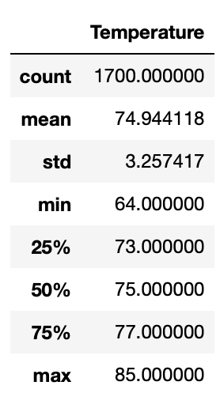
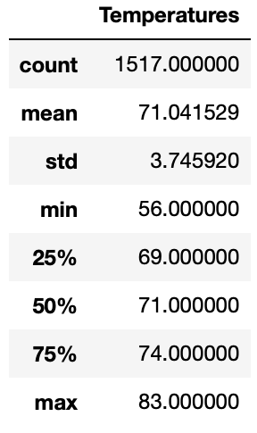
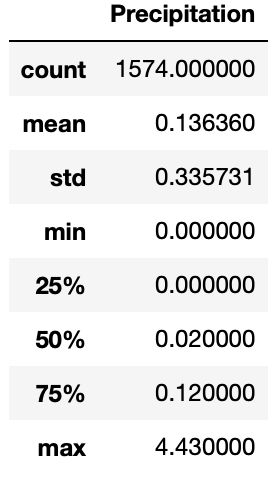
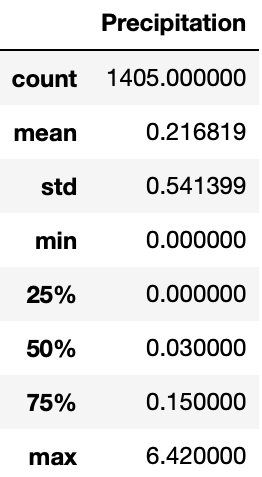

# Surfs Up
## Overview 
In this project we calculated the temperature in Hawaii for the months of June and December. We also performed statistical anaylsis of the data to get averages and deviations of the temperature.

## Purpose 
The purpose of this analysis was to provide a clear and concise table of the temperatures in the island Oahu. This table will be used by our client to present to investors so they can see that the temperature in Oahu is suitable for an icecream stand and can provide profits year round.
## Results 
### One: Average Temperature
- The mean average temperature during June was 75°F and in December it was 71°F. With only a 4 degree difference between a summer and winter month we see there is stability in the temperature year round.
### Two: Max Temperature 
- The max temperature for June and December are 85°F and 83°F respectively. While 85°F is a good temperature for a summer month 83°F for a winter month is really good since people don't tend to buy ice cream when its cold.
### Three: Min Temperature
- The min temperature for June and December are 64°F and 56°F
respectively. These temperatures are not attractive for ice cream sales because 64°F and especially 56°F are cold temperatures. However these temperatures are not so drastically cold that it would drive all potential customers away. 
## June
```
june = session.query(Measurement).filter(extract('month',Measurement.date) == 6)

june_temps = [temp.tobs for temp in june]
june_df = pd.DataFrame(june_temps, columns=["Temperatures"])

temps = list(np.ravel(june_df))

june_df = pd.DataFrame(temps,columns=["Temperature"])
```

## December
```
dec = session.query(Measurement).filter(extract('month',Measurement.date) == 12)

dec_temps = [temp.tobs for temp in dec]
dec_df = pd.DataFrame(dec_temps, columns=["Temperatures"])

temps = list(np.ravel(dec_df))

dec_df = pd.DataFrame(temps,columns=["Temperature"])
```


## Summary
In summary, from our analysis we can see that Oahu has a stable temperature in the mid to low 70's year-round which are stable numbers for ice cream sales. The maximum heat during summer 85°F is very good for business and the minimum temperature in winter is 56°F, while these temperatures are not good for ice cream sales, they're not so drastic that they will drive all potential customers away. In addition to these temperature analysis with two new tables for precipitation for June and December we can see how much rain there is in Oahu. 
### June Percipitation
From the June_prcp tabel we see there is a max of 4.43 inches of rain but, the mean average rain is only 0.14 inches of rain. 
```
june_prcp = [prcp.prcp for prcp in june]
june_pdf = pd.DataFrame(june_prcp, columns=["Precipitation"])
```


### December Percipitaion
From the December_prcp table we see there is a max of 6.42 inches pf rain but a mean average of only 0.2 inches of rain. 
```
dec_prcp = [prcp.prcp for prcp in dec]
dec_pdf = pd.DataFrame(dec_prcp, columns=["Precipitation"])
```
